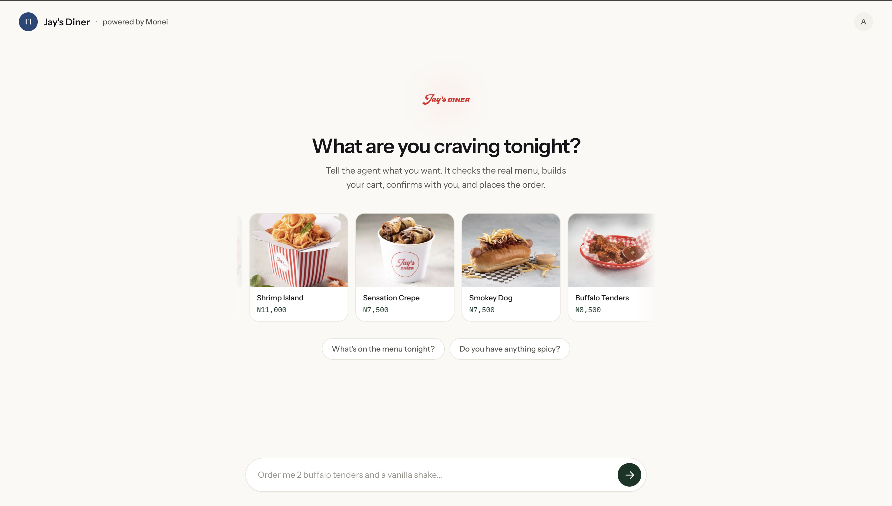

# Jay's Diner Agent, Frontend

The chat interface for [Jay's Diner Agent](https://github.com/Deji-404/jaysdiner_agent.git),
an AI agent that orders real food from a real restaurant and pays for it
with real money through [Monei](https://monei.cc). This repo is just the
frontend. You'll need the backend running too for any of this to
actually do anything.



## What's actually going on here

Most of what makes this interesting isn't visible at first glance. As
the agent works, it streams every step back to the frontend in real
time: which tool it's calling, what that tool found, when it starts
replying. The interface turns that into small colored pills that appear
and resolve inline in the chat, so watching the agent check a menu or
place an order feels like watching something actually happen, not just
waiting for a spinner.

Product cards, order confirmations, and the Monei payment card are all
built from the same structured data the agent's tools return. Nothing on
screen is a guess about what the agent did. It's a direct rendering of
the same JSON the model itself reads.

Paying for an order happens through a real PIN keypad that
talks straight to the backend. The PIN never passes through the chat or
anywhere near the language model. That separation is deliberate, not an
accident of how the code happened to get organized.

## Tech stack

- **Next.js 14** with the App Router
- **TypeScript**
- **Tailwind CSS**, with a small custom design system layered on top
  rather than default Tailwind styling

## Getting started

```bash
git clone https://github.com/Deji-404/jaysdiner-agent-frontend.git
cd jaysdiner-agent-frontend
npm install
```

Copy `.env.example` to `.env.local` and point `NEXT_PUBLIC_API_BASE` at
wherever the backend is running. For local development against a backend
on `localhost:8000`, the default already works, you don't need to change
anything.

```bash
npm run dev
```

Open `http://localhost:3000`. You'll need to register an account before
anything else works, since the whole app sits behind auth.

## Project structure

```
app/
├── page.tsx                The main chat page
├── profile/                 Account info, saved addresses, Monei wallet connection
├── orders/                    Order history, plus a detail view per order
└── layout.tsx                  Fonts and global page shell

components/
├── ChatPane.tsx              The chat itself, message rendering, the composer
├── ProductGrid.tsx            Scrollable menu item cards
├── MoneiPaymentCard.tsx         The branded payment card
├── MoneiPinKeypad.tsx             The PIN entry screen
└── ...                              Everything else the chat can render inline

lib/
├── useAgentChat.ts            Owns the whole conversation, parses the backend's event stream
├── useAuth.ts                  Login, registration, session persistence
└── ...                           One hook per backend feature area
```

## Design notes

The visual direction here went through a few real changes before landing
where it is. It started dark and receipt-themed, moved to a lighter warm
palette after direct feedback that the dark version read as generic AI
tooling, and picked up real branding (the actual Jay's Diner logo, real
menu photos, Monei's own colors on the payment card) once both partners'
assets were available. If you're extending this, the goal throughout was
to make agent activity feel like something you can actually watch happen
rather than a black box with a loading spinner on top of it.

## Deploying

Set `NEXT_PUBLIC_API_BASE` as a build-time environment variable pointing
at your deployed backend before running the build. Next.js bakes public
env vars into the JavaScript bundle at build time, not at runtime, so
this has to be set correctly before `next build` runs, not just added to
the server's environment afterward. See the backend repo's
`DEPLOYMENT.md` for the full deploy walkthrough covering both services.

## License

Apache 2.0. See [LICENSE](./LICENSE).